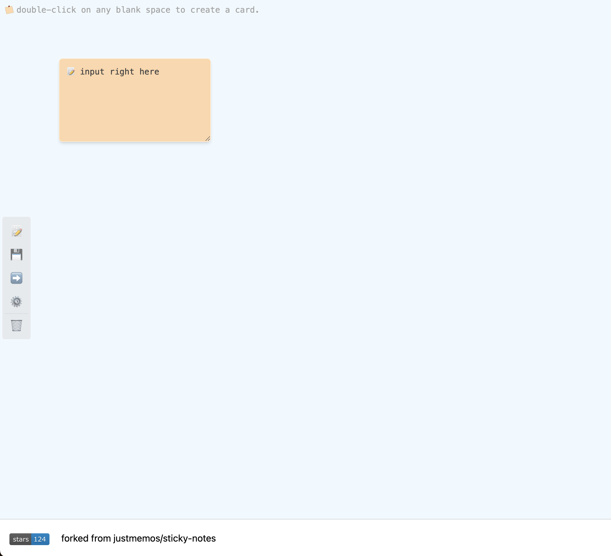

# Sticky notes

本项目是一个 Web 版本的便利贴，使用 React + Redux + TypeScript 开发。

源项目来自: https://github.com/boojack/sticky-notes 。由于项目相对简单，原作者应该是开源后不再进行更新了（最后一次更新是 2022-05-21），所以我 fork 了一份，进行了一些修改。

修改部分内容其实也是因为自己经常使用 **便利贴** 这个功能，但是原项目默认采用（而且仅仅支持）浏览器 `localStorage` 进行临时存储。而我个人的需要是需要在不同的电脑间进行共享，所以就自己改了一下。

## 新增功能

- 可以将当前便利贴保存在远端服务器
- 可以从远端服务器加载便利贴
- 设置功能，可以设置远端服务器的地址和用户名密码

### 后端服务接口

目前后端服务接口使用的是 `Java` 开发的，`API` 是基于 `Restful` 风格的。所以，您如果自行对照 `API` 使用其他语言开发接口也是可以的。

### 项目截图

> 再次感谢原作者的开源项目 [https://github.com/boojack/sticky-notes](https://github.com/boojack/sticky-notes)

> have fun! 2023-09-21